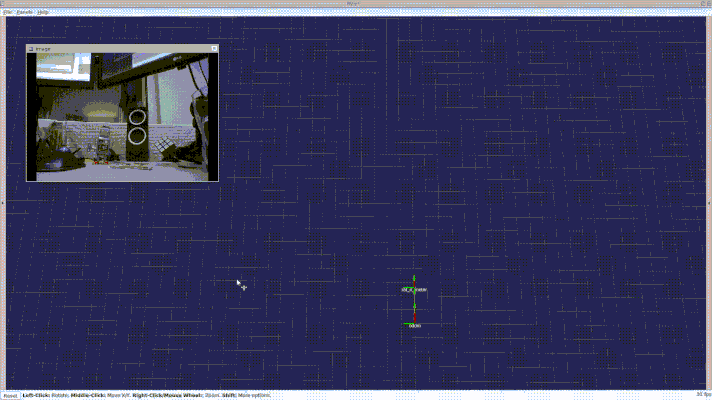
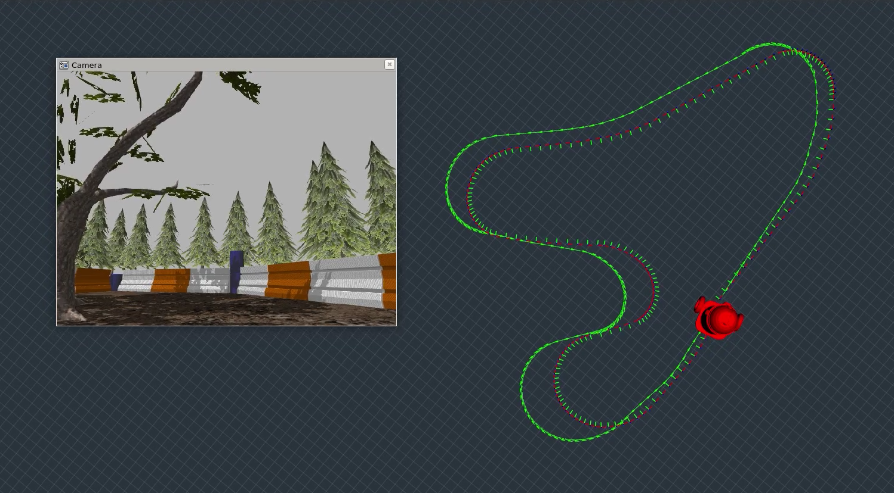

# mono_rat_viso
### Dirty and Lightweight Visual Odometry
_A reimplementation of David Balls monocular odometry from openRatSLAM as a standalone ROS package._

#### Concept
Main concept is image differencing where _"intensity profiles"_ - 1D arrays of pixel intensities - are compared to each other. Basically the rate of wandering of columns and rows are measured and these offsets are linearly scaled _(this part could be upgraded as validity of the linear scale depends on the content of the image and the movement of the camera)_.

For one angular velocity estimates are expected to be fairly good if the camera's horizontal field of view is known and it's framerate is measured. On the other hand linear translation is also sensitive to the camera rotation. To somewhat overcome this issue, regions of interests from the full frame can be selected separately for the translational and rotational components.



#### Params
It is recommended to allow the node to rely on *cmd_vel* to reset the position integrator. Also set *max_linear_vel* to discourage velocity integration errors above a certain speed. If an URDF is available use *transform_odom* to translate camera velocity vectors to the footprint frame. Calibrated camera is not required.
##### Setup
* don't forget to set horizontal field of view parameter
* monitor the twist component in the odometry message and tune lowpass filters first
* tune *vtrans_lin_scale* with linear movements only and try to compare the result to a ground truth
* tune *vtrans_rot_scale* with mixed rotational and linear movements
* hope for the best but don't expect too much


```yaml
base_footprint_frame: base_footprint
transform_odom: false # transform camera velocities to footprint
broadcast_tf: false

# filters
linear_highpass_cutoff:   0.01 # m/s
linear_lowpass_cutoff:    15.0 # Hz
angular_lowpass_cutoff:  100.0 # Hz

# camera
camera_topic:      head_camera/image_rect
camera_info_topic: head_camera/camera_info
subscribe_to_info: false
image_width: 640   # provide if subscribe_to_info is set to false
camera_fov_degrees: 75.0 # horizontal field of view

# region of interest for translation
trans_roi_x_min: 0    # top left corner
trans_roi_y_min: 240
trans_roi_x_max: 640  # bottom right corner
trans_roi_y_max: 480

# region of interest for rotation
rot_roi_x_min: 0    # top left corner
rot_roi_y_min: 240
rot_roi_x_max: 640  # bottom right corner
rot_roi_y_max: 480

# integration and scale
reset_by_cmd_vel: true     # cmd_vel resets and constrains integrator
max_angular_vel: 2.0       # clamp constraints for base maximum velocities
max_linear_vel:  0.35      #
reset_lin_vel:   0.05      # resets integrator below threshold if reset_by_cmd_vel is set to false

vtrans_lin_scale: 220   # scale of linear velocity when there is no rotation
vtrans_rot_scale: 200   # scale of linear velocity when there is rotation
```
#### Result
Although this solution is super simple and requires almost no computational power  - compared to sophisticated visual odometry methods - it's performance is also quite low. By introducing some filters and kinematic restrictions it became slightly better _(green)_:




_Source_

D. Ball, S. Heath, J. Wiles, G. Wyeth, P. Corke, M. Milford (2013) [OpenRatSLAM](http://www.davidmichaelball.com/portfolio-items/openratslam/): an open source brain-based SLAM system. Autonomous Robots 34 (3), 149-176.
